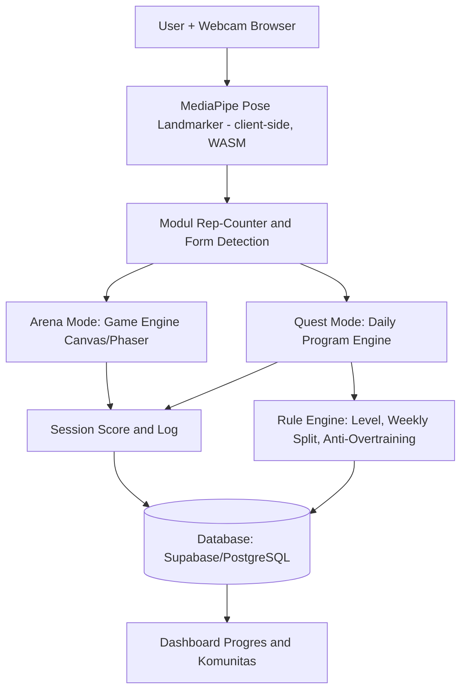

# GymQuest — Briefing Proyek untuk AI Coding Assistant

> **Kompetisi:** International Web Technology Competition
> **Tema:** Innovating for a Sustainable Future: Empowering Communities through Web Technology
> **SDG Fokus:** SDG 3 (Good Health & Well-Being) dan SDG 10 (Reduced Inequalities)
> **Deadline submission:** 20 September 2026

> **Status per 2026-09-07:** Fase 0–5 Selesai! Fase 1 (CV engine client-side terverifikasi 21+ FPS), Fase 2 (Rep-counting & form detection dengan kalibrasi sudut + audio cue Web Audio), Fase 3 (Arena Mode 2 game orisinal: Kuda Poni Terbang & Kangguru Lari + Web Audio procedural BGM/SFX), Fase 4 & 5 (Home Workout Engine / Quest Mode: Onboarding assessment kebugaran, 4 default scientific programs, runner dual-mode AI Camera & Timer, visualisasi 3D biomekanika interaktif Three.js bebas tabrakan + preset pencegahan cedera, custom workout builder), dan Fase 6 (Dashboard progres & kalender streak local storage). Fase 9 (UI/UX overhaul: tema subtle dark navy, kursor barbel 3D, responsive cockpit layout) telah terintegrasi mendalam. Fase 7 (Supabase cloud sync), Fase 8 (Komunitas), dan Fase 10 (Final testing & deploy Vercel) siap dilanjutkan.

## Cara Menggunakan Dokumen Ini

Dokumen ini adalah **konteks kerja utama** untuk AI coding assistant (Claude Code atau sejenisnya) dalam membangun proyek ini. Kerjakan **satu tahap penuh sampai memenuhi "Definition of Done"** sebelum lanjut ke tahap berikutnya — jangan lompat-lompat tahap. Setiap akhir tahap besar, commit ke git dengan pesan yang jelas dan update `README.md`. Nama "GymQuest" di dokumen ini hanya usulan, boleh diganti sesuai selera tim.

---

## 1. Ringkasan Proyek

**GymQuest** adalah web app yang mengubah aktivitas olahraga rumahan menjadi pengalaman bermain game menggunakan computer vision (deteksi pose tubuh lewat webcam), sekaligus menjadi pemandu latihan berbasis riset ilmiah bagi pemula yang tidak mampu menyewa personal trainer.

Ada dua mode utama:
- **Arena Mode** — mini-game (seperti Flappy Bird) yang dikendalikan gerakan tubuh nyata (mis. angkat tangan/dumbbell menggerakkan karakter naik-turun), sambil sistem mengoreksi form secara real-time.
- **Quest Mode** — program latihan harian terstruktur (misi harian: push-up, sit-up, squat, dst.) dengan target repetisi/set yang disesuaikan level pengguna (pemula/menengah/profesional), berbasis pedoman olahraga ilmiah, lengkap dengan logika anti-overtraining.

**Elevator pitch:** *"Personal trainer digital yang gratis, jalan langsung di browser, dan membuat olahraga di rumah terasa seperti main game — tanpa alat mahal, tanpa biaya bulanan."*

---

## 2. Target Pengguna

1. **Pemula tanpa akses gym/PT** — butuh panduan gerakan yang benar tapi tidak punya biaya.
2. **Pekerja/mahasiswa sibuk** — butuh motivasi rutin, gampang bosan olahraga sendirian.
3. **Komunitas underserved** (daerah dengan akses fasilitas olahraga terbatas) — cukup modal webcam/laptop/HP.

---

## 3. Arsitektur Sistem



**Prinsip arsitektur kunci:**
- **Computer vision berjalan 100% di client-side** (browser, via WebAssembly). Video kamera **tidak pernah dikirim ke server** — ini penting untuk privasi, latensi rendah, dan biaya server yang murah (langsung mendukung kriteria *Scalability and Sustainability* dan SDG 10 karena tetap ringan dipakai user dengan koneksi lambat).
- Backend hanya menangani data ringan: akun, log repetisi/sesi, leaderboard komunitas.

### Tech Stack yang Digunakan

| Layer | Pilihan | Alasan |
|---|---|---|
| Frontend | Next.js 15 (React 19) + TypeScript + TailwindCSS | Cepat untuk tim kecil, SSR/SSG untuk performa, ekosistem besar |
| Computer Vision | MediaPipe Tasks Vision — Pose Landmarker | Jalan di browser via WASM, akurat, gratis, tanpa server ML (100% client-side privacy) |
| 3D Biomechanical Engine | Three.js (WebGL) | Visualisasi manekin kinetik 3D interaktif 360°, edukasi form sendi & pencegahan cedera real-time |
| Game Rendering | HTML5 Canvas API | Ringan, 60 FPS stabil untuk mini-game Arena (Kuda Poni & Kangguru) |
| Audio System | Web Audio API (Synthesizer procedural) | Efek suara SFX & musik BGM dinamis tanpa dependensi file audio eksternal |
| State & Storage | React Hooks + LocalStorage (Persiapan Supabase) | Ringan, responsif, data latihan dan progres tersimpan persisten secara lokal |
| Backend/DB (Target) | Supabase (Postgres + Auth + Realtime) | Setup cepat, gratis untuk skala kompetisi, auth siap pakai |
| Hosting | Vercel (frontend) + Supabase (DB) | Free tier cukup untuk demo, deploy otomatis dari GitHub |
| PWA (opsional) | next-pwa | Installable di HP, bisa dicoba offline-first untuk aksesibilitas |

---

## 4. Model Data Inti

| Entity | Field Utama |
|---|---|
| `User` | id, nama, email, bahasa, dibuat_pada |
| `FitnessAssessment` | user_id, exercise, hasil_rep, tanggal, level_hasil |
| `ExerciseDefinition` | kode (push_up, squat, sit_up, plank, arm_raise), kelompok_otot, sudut_sendi_kunci, tipe_hitung (rep/durasi) |
| `WeeklyProgram` | user_id, level, jadwal_harian (kelompok otot per hari), minggu_ke |
| `WorkoutSession` | user_id, tanggal, mode (arena/quest), exercise, set, reps_tercapai, skor_form |
| `RepLog` | session_id, timestamp, sudut_terdeteksi, valid (true/false) |
| `LevelProgress` | user_id, level_sekarang, xp, streak, badge[] |
| `CommunityChallenge` | nama, target_total_rep, progres_terkumpul, periode |

---

## 5. Konfigurasi Data Berbasis Riset (Starting Point)

Gunakan pendekatan **config-driven** (bukan hardcode tersebar di kode) supaya mudah disesuaikan. Contoh `config/exercise-levels.json` sebagai titik awal, disusun mengacu kerangka umum ACSM (frekuensi latihan & prinsip progressive overload):

```json
{
  "levels": {
    "pemula": {
      "sesi_per_minggu": 3,
      "rest_minimum_antar_kelompok_otot_jam": 48,
      "exercises": {
        "push_up": { "sets": 2, "reps": 8 },
        "sit_up": { "sets": 2, "reps": 10 },
        "squat": { "sets": 2, "reps": 10 },
        "plank": { "sets": 2, "durasi_detik": 20 }
      }
    },
    "menengah": {
      "sesi_per_minggu": 4,
      "rest_minimum_antar_kelompok_otot_jam": 48,
      "exercises": {
        "push_up": { "sets": 3, "reps": 15 },
        "sit_up": { "sets": 3, "reps": 20 },
        "squat": { "sets": 3, "reps": 18 },
        "plank": { "sets": 3, "durasi_detik": 40 }
      }
    },
    "profesional": {
      "sesi_per_minggu": 5,
      "rest_minimum_antar_kelompok_otot_jam": 48,
      "exercises": {
        "push_up": { "sets": 4, "reps": 25 },
        "sit_up": { "sets": 4, "reps": 30 },
        "squat": { "sets": 4, "reps": 25 },
        "plank": { "sets": 4, "durasi_detik": 60 }
      }
    }
  },
  "progressive_overload_rule": "Jika user melebihi batas atas target 2 sesi berturut-turut dengan form baik, naikkan target 5-10% pada sesi berikutnya.",
  "aturan_rest_wajib": "Minimal 1 hari istirahat penuh per minggu untuk semua level."
}
```

> ⚠️ **Catatan penting:** angka-angka ini adalah titik awal ilustratif berdasarkan kerangka umum riset olahraga, **bukan resep medis**. Cantumkan disclaimer di aplikasi ("bukan pengganti nasihat dokter/pelatih bersertifikat") dan idealnya minta reviu dosen pembimbing/pihak berkompeten sebelum submission.

---

## 6. Tahapan Pengerjaan (Development Phases)

Setiap tahap punya **Tujuan**, **Tugas**, dan **Definition of Done (DoD)**. Checklist bisa langsung dipakai sebagai task tracker.

### Fase 0 — Persiapan & Fondasi Proyek 🚧
**Tugas:**
- [x] Init repo Next.js + TypeScript + Tailwind
- [x] Setup ESLint, Prettier, struktur folder (lihat Bagian 8)
- [ ] Setup deploy pipeline dasar ke Vercel
- [x] Buat skeleton `README.md` (akan dilengkapi di Fase 10)

**DoD:** Proyek jalan lokal (`npm run dev`), versi kosong ter-deploy dan bisa diakses via URL publik.

### Fase 1 — Computer Vision Engine (Fondasi Inti) ✅
**Tugas:**
- [x] Integrasi MediaPipe Pose Landmarker (client-side, WASM & model di-host sendiri di `public/mediapipe`)
- [x] Halaman kalibrasi `/kalibrasi`: panduan visual per bagian tubuh + pesan arahan kontekstual
- [x] Ekstraksi landmark tubuh + smoothing One Euro filter (`src/modules/cv-engine/smoothing.ts`)
- [x] Overlay skeleton real-time di atas video kamera (Bio-Scan HUD, `drawBioScan.ts`)
- [x] Verifikasi dengan kamera nyata: Chrome desktop, confidence 90%, **21 FPS**, semua region terdeteksi

**Catatan hasil uji (2026-08-27):**
- Sempat ada bug overlay meleset dari tubuh — landmark ternormalisasi terhadap frame asli kamera, sedangkan video ditampilkan `object-cover` (terpotong). Sudah dikoreksi di `drawBioScan.ts`.
- FPS bertahan di ~21 (memenuhi DoD ≥20, tapi tipis). Optimasi throttle re-render React hanya menaikkan +1 FPS, artinya hambatan ada di inference model / frame rate webcam di cahaya indoor — **perlu ditindaklanjuti di Fase 10**.
- **Belum diuji di mobile** dan belum diuji di kondisi cahaya redup.

**DoD:** Skeleton overlay stabil & akurat di pencahayaan normal, berjalan minimal di Chrome desktop & mobile, frame rate cukup untuk terasa real-time (idealnya ≥20 FPS).

### Fase 2 — Rep-Counting & Form Detection ✅
**Tugas:**
- [x] Definisikan sudut sendi kunci per exercise (push-up: siku; squat: lutut+pinggul; sit-up: sudut torso; plank: kelurusan tubuh; arm raise: sudut bahu) — `src/modules/rep-counter/exercises.ts`
- [x] Bangun state machine hitung repetisi (naik-turun-naik) supaya tidak double-count — `repCounter.ts`
- [x] Logika threshold form benar/salah + flag visual (skeleton berubah **merah** saat form salah, lewat `drawBioScan.ts`)
- [x] Halaman `/exercise`: kamera full-bleed, rep counter besar dengan animasi, dock exercise picker, countdown sesi 60 detik
- [x] Sistem Audio Feedback: Web Audio SFX sintetis untuk rep valid dan koreksi form
- [x] Kalibrasi sudut sendi dan penyesuaian threshold biomekanik

**DoD:** Minimal 3 exercise (push-up, squat, sit-up) punya rep-counter dengan akurasi memadai, form-feedback tampil real-time, dan audio cue menyala saat rep berhasil.

> **Catatan teknis penting:** pull-up butuh alat (bar) dan sudut kamera khusus (idealnya dari samping), sehingga sulit dideteksi akurat dari webcam depan standar. **Untuk MVP, prioritaskan exercise yang mudah dideteksi kamera depan**: push-up, squat, sit-up, plank, arm/shoulder raise.

### Fase 3 — Mini-Game Engine (Arena Mode) ✅
> Dikerjakan lebih awal dari urutan asli atas permintaan tim: karakter diganti kuda poni (bukan flappy bird generik) dengan dua skema kontrol nyata (push-up & angkat barbel), serta game kangguru lari untuk squat.

**Tugas:**
- [x] Bangun game loop dasar (Canvas API) — `src/modules/game-engine/ponyGame.ts`
- [x] Kontrol vertikal dari gerakan tubuh nyata: posisi wajah untuk mode push-up, posisi lengan untuk mode angkat barbel — `verticalControl.ts` dengan auto-kalibrasi rentang gerak
- [x] Integrasi rep-counter dari Fase 2 ke gameplay: tiap rep valid memberi bonus skor, ditampilkan terpisah dari skor obstacle
- [x] Halaman `/arena`: layar pilih game + mode, game dominan + kamera PIP, HUD skor/reps/nyawa/countdown, layar ringkasan + main lagi
- [x] Mini-game kedua: **Kangguru Lari** (`kangarooGame.ts`) — endless runner squat: jongkok = menunduk di bawah rintangan terbang, berdiri menyelesaikan rep = melompati rintangan darat
- [x] **Web Audio Synthesizer**: 8-bit procedural BGM & sound effects dinamis tanpa file audio eksternal (`audio.ts`)
- [x] Aset visual & partikel barbel neon bertema kebugaran

**DoD:** Minimal 2 game playable end-to-end, terhubung real-time ke data pose, skor tersimpan per sesi, dilengkapi audio prosedural 8-bit.

### Fase 4 — Kalibrasi Kebugaran & Sistem Level ✅
**Tugas:**
- [x] Alur onboarding & assessment awal (`OnboardingModal.tsx`): kuisioner interaktif tingkat kebugaran, kelompok otot fokus, alokasi waktu harian
- [x] Logika klasifikasi otomatis ke level pemula/menengah/profesional berdasarkan profiling pengguna
- [x] Load target rep/set/durasi dari konfigurasi ilmiah terstruktur (`exerciseCatalog.ts`, `defaultPrograms.ts`)
- [x] Kemampuan pengguna menyesuaikan program latihan manual lewat Custom Workout Builder
- [x] Penyimpanan preferensi & profil pengguna di browser via LocalStorage (`storage.ts`)

**DoD:** User baru disambut onboarding interaktif, otomatis terklasifikasi ke level kebugaran yang tepat, dan langsung disajikan program harian yang sesuai.

### Fase 5 — Quest Mode / Home Workout Engine: Program Terstruktur & Cockpit Latihan ✅
**Tugas:**
- [x] 4 Program latihan ilmiah siap pakai: *Full Body Beginner, Upper Body Power, Core & Abs Sculpt, Lower Body Blast* dengan pembagian otot dan waktu istirahat teratur
- [x] Halaman katalog `/programs` & rincian program `/programs/[id]` dengan pratinjau gerakan dan kalkulasi estimasi kalori/durasi
- [x] **Workout Cockpit Runner (`/workout`)**: Dual-mode fleksibel:
  - **AI Camera Mode**: Pose tracking real-time dengan kamera, hitung rep otomatis, dan koreksi form
  - **Timer / Manual Mode**: Kontrol berbasis waktu otomatis bagi pengguna tanpa webcam atau di ruangan sempit
- [x] **Visualisasi 3D Interaktif (Three.js Biomechanical Engine)** (`ExerciseVisual3D.tsx`):
  - Manekin kinetik atletik 3D berproporsi realistis (pelvis, V-taper torso, dual-joint limbs, visor glow)
  - Kontrol kamera orbit bebas 360° dengan mouse drag / touch gesture
  - **3 Tombol Cepat Preset Sudut Pandang Edukasi Form & Pencegahan Cedera**:
    - `0° Depan`: Memeriksa keselarasan bahu & simetri gerakan
    - `45° Serong`: Sudut pandang isometrik tiga dimensi menyeluruh
    - `90° Samping`: Evaluasi kelurusan tulang belakang (*lumbar alignment*), engsel panggul (*hip hinge*), dan jalur lutut
  - **Kinematika Realistis Anti-Tabrakan (*Collision-Free Biomechanics*)**:
    - *Push-up*: Siku menekuk keluar 45°–55° (*arrowhead form*) & jari kaki menapak terkunci di lantai (`grounded toe pivot`)
    - *Forward Lunges*: Kedua tangan menjulur lurus ke depan untuk keseimbangan (*counterbalance*)
    - *Core Plank*: Pandangan kepala & mata menghadap ke depan lurus sepanjang lantai
  - Pendaran dinamis aktivasi otot target (*dynamic muscle highlight*)
- [x] **Custom Workout Builder** (`CustomWorkoutModal.tsx`): Pengguna dapat merancang sesi latihan personal dari katalog gerakan

**DoD:** User dapat memilih program, melihat rincian latihan, dan mengeksekusi sesi latihan secara interaktif dengan panduan visual 3D 360° dan umpan balik real-time.

### Fase 6 — Gamifikasi & Progres 🚧
**Tugas:**
- [x] Halaman dashboard progres & kalender interaktif (`/progress`): visualisasi riwayat latihan, streak tracker harian, total repetisi, dan total menit olahraga
- [x] Sistem persistence lokal (`storage.ts`): riwayat sesi latihan, streak, dan data profil tersimpan aman di browser
- [x] Sistem 5 Liga Tematik & Leaderboard Mingguan (`/leaderboard`, `leagues.ts`, `leaderboardStorage.ts`):
  - 5 Liga RPG: 🛡️ Iron Initiate, 🥉 Bronze Brawler, 🥈 Silver Striker, 🥇 Gold Gladiator, 👑 Titan Colossus
  - Siklus musim 7 hari (168 jam) dengan real-time countdown timer
  - Sistem bracket 11 kontestan per kasta liga berbasis perolehan EXP
  - Mekanisme otomatis evaluasi akhir musim: 3 Teratas Promosi (🟢), 5 Tengah Bertahan (🟡), 3 Terbawah Degradasi (🔴)
  - Integrasi perolehan EXP langsung dari penyelesaian latihan di `/workout`
- [ ] Sistem Badge/achievement lanjutan (akan disinkronkan ke Supabase di Fase 7/8)
- [ ] Re-assessment berkala untuk penyesuaian level otomatis

**DoD:** Dashboard menampilkan ringkasan aktivitas, streak harian, leaderboard 5 kasta liga mingguan yang kompetitif, dan riwayat sesi latihan yang persisten antar sesi browser.

### Fase 7 — Akun Pengguna & Data Persistence (Cloud Sync) 🚧
**Tugas:**
- [x] Autentikasi Supabase Auth (`AuthModal.tsx`, `syncManager.ts`, `client.ts`): Login dan pendaftaran akun pengguna via Email & Password
- [x] Database Schema & Keamanan RLS (`supabase_schema.sql`): Tabel `profiles`, `workout_logs`, `custom_programs`, kebijakan Row Level Security, dan auto-trigger profil pengguna baru
- [x] Tombol & Status Akun Pengguna (`UserNavButton.tsx`): Terpasang di seluruh navigasi global (Home, Programs, Progress, Leaderboard) dengan indikator status sinkronisasi cloud
- [x] Sinkronisasi Data Dua Arah (`syncManager.ts`, `storage.ts`): Penggabungan data lokal dengan PostgreSQL Supabase dan *background sync* otomatis saat sesi latihan selesai
- [ ] Menghubungkan kredensial aktif Supabase (`NEXT_PUBLIC_SUPABASE_URL` dan `NEXT_PUBLIC_SUPABASE_ANON_KEY`) dari user

**DoD:** User dapat mendaftar/masuk dan data latihan tersinkronisasi lintas perangkat. Dilengkapi *offline fallback* otomatis jika belum terkoneksi.

### Fase 8 — Fitur Komunitas 🚧
**Tugas:**
- [x] Pembuatan game push-up battle 2 pemain split-screen (`/arena/battle`):
  - **Dragon Ball Kamehameha & Final Flash Battle Engine**: Karakter dilengkapi efek Super Saiyan Ki Aura, Ki Charge saat posisi kontraksi bawah push-up (`triggerKiCharge`), gelombang energi Kamehameha berpusar ganda (*double-helix energy spirals*) saat push-up sah (`triggerRepAttack`), efek benturan balok energi dahsyat (*Beam Clash*), getaran layar (*screen shake*), dan teks shout anime dinamis (*x10 Kaio-Ken, Super Kamehameha, Final Flash*).
  - **Live Biometric Camera Feed**: Tampilan webcam Player 1 jernih tanpa overlay penghalang, pemindaian kerangka biomekanik real-time (`drawBioScan`), deteksi postur push-up otomatis, serta tombol toggle ukuran kamera (*expand/shrink*).
  - **Dukungan Kontrol Lengkap**: Deteksi webcam AI pose tracking + kontrol keyboard instan (`[Spasi]/[A]` untuk Kamehameha, `[S]` untuk Charge Ki, `[Enter]/[L]` untuk Final Flash, `[K]` untuk Charge Ki P2).
- [x] Leaderboard skor Arena Mode & Hall of Fame Push-Up Battle di `/leaderboard`
- [x] Fitur berbagi pencapaian latihan (`ShareAchievementModal.tsx`): Share langsung ke WhatsApp dengan teks ringkasan & generator otomatis poster Instagram Story beresolusi tinggi (format 9:16 PNG)
- [ ] Tantangan komunitas mingguan (agregasi total repetisi kumulatif semua pengguna)

**DoD:** Pengguna dapat bertanding push-up 1v1 split-screen dengan animasi pertarungan Kamehameha ala Dragon Ball yang memukau, membagikan kartu rekor latihan ke media sosial, serta melihat kontribusi repetisi mereka terhadap tantangan komunitas global.

### Fase 9 — UI/UX, Aksesibilitas & Desain Modern ✅
**Tugas:**
- [x] Onboarding ramah pemula dengan dialog terpandu (`OnboardingModal.tsx`)
- [x] Perombakan tema visual: Mengganti hitam pekat dengan **Subtle Dark Navy** (`#070c1e`, `#131e47`) beraksen neon cyan & magenta yang mewah
- [x] **Kursor Kustom 3D Barbel**: Kursor bertema barbel krom dengan pendaran neon untuk interaksi klik & hover
- [x] Aksesibilitas & Fallback: Dual-mode workout runner (AI Camera & Timer Manual tanpa kamera)
- [x] Desain tata letak cockpit yang padat, adaptif, dan responsif (minim area kosong)
- [ ] Toggle multi-bahasa (Indonesia / English)

**DoD:** Antarmuka terasa premium, responsif, nyaman di mata, bertema kebugaran kohesif, dan ramah pengguna di segala kondisi perangkat.

### Fase 10 — Testing, Optimisasi & Dokumentasi 🚧
**Tugas:**
- [x] Validasi TypeScript (`npx tsc --noEmit`): 0 error
- [x] Validasi Next.js Production Build (`npm run build`): Berhasil 100%
- [x] Dokumentasi visual 3D & biomekanika di `walkthrough.md`
- [x] Update komprehensif briefing proyek di `GymQuest_AI_Coding_Briefing.md`
- [ ] Uji lintas browser & kondisi pencahayaan webcam nyata
- [ ] Deploy publik ke Vercel & setup domain
- [ ] Rekam video demonstrasi alur kerja (Arena, Quest, 3D Engine, Progres)

**DoD:** Repo GitHub lengkap dengan dokumentasi teknis standar kompetisi, live demo aktif di Vercel, dan video demo siap tayang.

---

## 7. Timeline yang Disarankan (4 Minggu Menuju 20 September 2026)

```mermaid
gantt
    title Timeline Pengembangan GymQuest
    dateFormat  YYYY-MM-DD
    section Minggu 1 - Fondasi
    Setup Proyek (Fase 0)              :a1, 2026-08-24, 2d
    CV Engine (Fase 1)                 :a2, after a1, 3d
    Rep-Counting and Form (Fase 2)     :a3, after a2, 2d
    section Minggu 2 - Core Product
    Mini-Game Engine (Fase 3)          :b1, after a3, 3d
    Kalibrasi and Level (Fase 4)       :b2, after b1, 2d
    Weekly Split and Quest (Fase 5)    :b3, after b2, 2d
    section Minggu 3 - Fitur Pendukung
    Gamifikasi (Fase 6)                :c1, 2026-09-07, 2d
    Akun and Data (Fase 7)             :c2, after c1, 2d
    Fitur Komunitas (Fase 8)           :c3, after c2, 2d
    UI/UX and Aksesibilitas (Fase 9)   :c4, after c3, 1d
    section Minggu 4 - Finalisasi
    Testing and Optimisasi             :d1, 2026-09-14, 2d
    Dokumentasi (Fase 10)              :d2, after d1, 2d
    Video Demo and Deploy              :d3, after d2, 2d
    Buffer and Submission              :d4, after d3, 1d
```



Diagram ini juga bisa langsung dipakai/diadaptasi untuk bagian **"Development Methodology"** di proposal lomba.

---

## 8. Struktur Repository Terkini

```
gymquest/
├── README.md
├── GymQuest_AI_Coding_Briefing.md   # Dokumen briefing & tracker proyek
├── GymQuest_UIUX_Briefing.md        # Panduan estetika & desain sistem
├── docs/
│   ├── ARCHITECTURE.md
│   ├── INSTALLATION.md
│   ├── TECH_STACK.md
│   └── TECHNICAL_DOCUMENTATION.md
├── public/
│   ├── cursors/                     # Kursor kustom 3D barbel (normal & hover)
│   └── mediapipe/                   # WASM & model pose landmarker lokal
├── src/
│   ├── app/                         # Next.js 15 App Router
│   │   ├── arena/                   # Arena Mode (Kuda Poni & Kangguru Lari)
│   │   ├── exercise/                # Modul latihan & deteksi repetisi independen
│   │   ├── kalibrasi/               # Panduan kalibrasi & pengenalan postur tubuh
│   │   ├── programs/                # Katalog program latihan ilmiah
│   │   │   ├── page.tsx             # List program terstruktur & custom
│   │   │   └── [id]/page.tsx        # Rincian program, gerakan, & estimasi kalori
│   │   ├── progress/                # Dashboard progres & kalender riwayat latihan
│   │   ├── workout/                 # Cockpit latihan dual-mode (AI Camera & Timer)
│   │   ├── globals.css              # Tema Subtle Dark Navy & kursor barbel
│   │   ├── layout.tsx               # Root layout
│   │   └── page.tsx                 # Landing page utama
│   ├── components/
│   │   ├── CameraStage.tsx          # Wrapper feed video & BioScan canvas
│   │   ├── ConfidenceBar.tsx        # Indikator kualitas deteksi pose
│   │   ├── CustomWorkoutModal.tsx   # Modal perancang latihan kustom
│   │   ├── ExerciseDock.tsx         # Pemilih gerakan cepat
│   │   ├── ExerciseVisual.tsx       # Smart visual dispatcher (3D Three.js & fallback)
│   │   ├── ExerciseVisual3D.tsx     # Three.js 3D Biomechanical Engine (Orbit 360°, preset kamera pencegah cedera)
│   │   ├── OnboardingModal.tsx      # Assessment kebugaran awal & penentuan level
│   │   ├── RepCounterDisplay.tsx    # HUD penghitung repetisi & umpan balik
│   │   └── StatusDot.tsx            # Indikator status koneksi deteksi
│   ├── config/
│   │   └── exercise-levels.json     # Konfigurasi ACSM level kebugaran
│   └── modules/
│       ├── cv-engine/               # MediaPipe landmarker, kalibrasi, smoothing
│       ├── game-engine/             # Arena mini-game, kontrol vertikal, Web Audio synth
│       │   ├── audio.ts             # Synthesizer procedural BGM & SFX 8-bit
│       │   ├── kangarooGame.ts      # Endless runner kangguru (kontrol squat)
│       │   ├── ponyGame.ts          # Flappy-style kuda poni (kontrol push-up & beban)
│       │   └── verticalControl.ts   # Pemetaan gerakan vertikal tubuh
│       ├── program-engine/          # Katalog latihan, default programs, local persistence
│       │   ├── defaultPrograms.ts   # 4 Program latihan ilmiah
│       │   ├── exerciseCatalog.ts   # Katalog gerakan & biomekanika tubuh
│       │   ├── storage.ts           # LocalStorage adapter & tracker
│       │   └── types.ts             # Tipe data program, sesi, & progres
│       └── rep-counter/             # State machine rep, sudut sendi, form validation
├── tests/
└── package.json
```

---

## 9. Batasan & Hal yang Perlu Diperhatikan

- **Privasi:** video kamera tidak boleh dikirim/disimpan di server — semua pemrosesan CV di client-side.
- **Disclaimer kesehatan:** aplikasi ini adalah alat bantu, bukan pengganti nasihat medis atau pelatih bersertifikat. Tampilkan disclaimer ini di onboarding.
- **Keterbatasan deteksi:** exercise yang butuh alat/sudut kamera khusus (pull-up) diprioritaskan belakangan.
- **Variasi kondisi user:** pencahayaan dan kualitas webcam bisa memengaruhi akurasi — pastikan ada panduan kalibrasi yang jelas dan pesan error yang membantu, bukan menyalahkan user.
- **Prioritas waktu:** dengan deadline 20 September 2026, Fase 0–6 adalah **MVP wajib**. Fase 7–9 penting untuk nilai UX/SDG tapi bisa disederhanakan jika waktu mepet. Fase 10 tidak boleh dilewati karena langsung menentukan syarat submission.

---

## 10. Ide Pengembangan Tambahan (Bonus, Opsional)

Fitur-fitur ini tidak wajib untuk MVP, tapi bisa memperkuat nilai *Innovation* dan *Scalability* jika sempat dikerjakan atau cukup dicantumkan sebagai roadmap di proposal:

- **AI Coach berbasis LLM:** ringkasan mingguan otomatis + tips personal (mis. lewat Anthropic API) berdasarkan pola form/konsistensi user — mengubah data mentah jadi saran yang terasa personal.
- **Mode Pemulihan Aktif:** di hari istirahat, tawarkan mini-game peregangan ringan alih-alih kosong total, agar streak tetap jalan tanpa melanggar prinsip pemulihan otot.
- **Skor Risiko Form:** jika kesalahan form berulang terdeteksi di sendi yang sama, tampilkan video tutorial singkat otomatis.
- **Statistik "Hemat Biaya PT":** tampilkan estimasi penghematan dibanding sewa personal trainer bulanan — memperkuat narasi SDG 10 secara visual.
- **PWA offline-first:** agar tetap bisa dipakai di koneksi internet lambat/terputus-putus.
- **Voice/audio cues:** panduan suara untuk aksesibilitas pengguna dengan keterbatasan penglihatan.
- **Roadmap wearable device:** disebutkan di proposal sebagai rencana jangka panjang untuk memperkuat bagian *Scalability and Sustainability*, tanpa perlu dibangun sekarang.

---

## 11. Checklist Kesesuaian dengan Rubrik Penilaian

### Preliminary Evaluation

| Kriteria | Bobot | Dipenuhi Lewat |
|---|---|---|
| Problem Identification and Relevance | 15% | Problem statement di proposal + README, didukung data biaya PT & risiko cedera olahraga mandiri |
| Innovation and Creativity | 20% | Dual-mode (Arena + Quest), form-correction sebagai mekanik game, sistem level berbasis riset |
| Technical Implementation | 25% | CV client-side, rep-counter akurat (Fase 1-2), rule engine anti-overtraining (Fase 5), arsitektur modular |
| User Experience and Interface Design | 15% | Onboarding ramah pemula, aksesibilitas, mobile-responsive (Fase 9) |
| SDGs Alignment and Sustainable Impact | 15% | Fitur konkret SDG 3 (cegah cedera, form correction) & SDG 10 (gratis, statistik hemat biaya) |
| Scalability and Sustainability | 10% | Engine modular (game baru tinggal plug-in), biaya server rendah (CV client-side), roadmap fitur |

### Final Evaluation

| Kriteria | Bobot | Persiapan |
|---|---|---|
| Project Presentation | 20% | Siapkan slide + narasi yang runtut: masalah → solusi → demo → dampak |
| Project Demonstration and Functionality | 25% | Skenario demo 5 menit yang menyentuh Arena Mode, Quest Mode, dan dashboard progres — pastikan stabil sebelum hari-H |
| Innovation and Problem-Solving | 20% | Tekankan form-correction sebagai mekanik game (bukan sekadar gimmick kontrol) |
| SDGs Alignment and Potential Impact | 15% | Siapkan angka dampak (estimasi hemat biaya, potensi jangkauan komunitas) |
| Response to Judges' Questions | 15% | Semua anggota tim paham keputusan teknis kunci (kenapa client-side CV, kenapa level berbasis riset, dsb.) |
| Teamwork and Professionalism | 5% | Bagi peran presentasi & demo secara jelas antar anggota tim |

---

## 12. Referensi Ilmiah untuk Bagian "References" di Proposal

- Ratamess, N. A., et al. (2009). *Progression Models in Resistance Training for Healthy Adults.* ACSM Position Stand, Medicine & Science in Sports & Exercise, 41(3), 687–708.
- American College of Sports Medicine (2026). *Resistance Training Guidelines Update* (pembaruan pertama dalam 17 tahun — endorse latihan bodyweight/rumahan sebagai efektif).
- Meeusen, R., et al. (2013). *Prevention, Diagnosis, and Treatment of the Overtraining Syndrome.* Consensus statement, European College of Sport Science & American College of Sports Medicine.

> Catatan: cek kembali sitasi lengkap (DOI/volume/halaman terbaru) sebelum dimasukkan ke proposal final.
