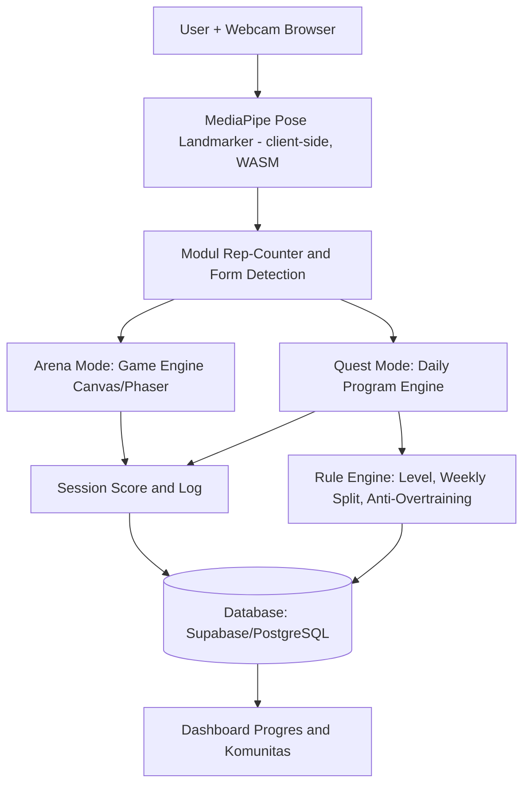
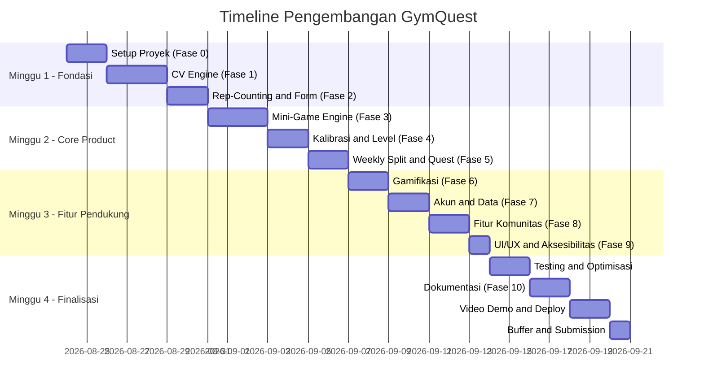

# GymQuest — Briefing Proyek untuk AI Coding Assistant

> **Kompetisi:** International Web Technology Competition
> **Tema:** Innovating for a Sustainable Future: Empowering Communities through Web Technology
> **SDG Fokus:** SDG 3 (Good Health & Well-Being) dan SDG 10 (Reduced Inequalities)
> **Deadline submission:** 20 September 2026

> **Status per 2026-08-27:** Fase 0 selesai kecuali deploy Vercel. Fase 1 (CV engine) selesai dan **terverifikasi dengan kamera nyata** (skeleton akurat, confidence 90%, 21 FPS). Fase 2 (rep-counting) kode selesai, belum diuji akurasi manual. Fase 3 (Arena) dikerjakan lebih awal atas permintaan tim — game kuda poni dengan mode push-up & angkat barbel sudah jalan, tapi baru 1 game (DoD minta 2) dan belum diuji dengan kamera. Fase 4–10 belum dikerjakan.

## Cara Menggunakan Dokumen Ini

Dokumen ini adalah **konteks kerja utama** untuk AI coding assistant (Claude Code atau sejenisnya) dalam membangun proyek ini. Kerjakan **satu tahap penuh sampai memenuhi "Definition of Done"** sebelum lanjut ke tahap berikutnya — jangan lompat-lompat tahap. Setiap akhir tahap besar, commit ke git dengan pesan yang jelas dan update `README.md`. Nama "GymQuest" di dokumen ini hanya usulan, boleh diganti sesuai selera tim.

---

## 1. Ringkasan Proyek

**GymQuest** adalah web app yang mengubah aktivitas olahraga rumahan menjadi pengalaman bermain game menggunakan computer vision (deteksi pose tubuh lewat webcam), sekaligus menjadi pemandu latihan berbasis riset ilmiah bagi pemula yang tidak mampu menyewa personal trainer.

Ada dua mode utama:
- **Arena Mode** — mini-game (seperti Flappy Bird) yang dikendalikan gerakan tubuh nyata (mis. angkat tangan/dumbbell menggerakkan karakter naik-turun), sambil sistem mengoreksi form secara real-time.
- **Quest Mode** — program latihan harian terstruktur (misi harian: push-up, sit-up, squat, dst.) dengan target repetisi/set yang disesuaikan level pengguna (pemula/menengah/profesional), berbasis pedoman olahraga ilmiah, lengkap dengan logika anti-overtraining.

**Elevator pitch:** *"Personal trainer digital yang gratis, jalan langsung di browser, dan membuat olahraga di rumah terasa seperti main game — tanpa alat mahal, tanpa biaya bulanan."*

---

## 2. Target Pengguna

1. **Pemula tanpa akses gym/PT** — butuh panduan gerakan yang benar tapi tidak punya biaya.
2. **Pekerja/mahasiswa sibuk** — butuh motivasi rutin, gampang bosan olahraga sendirian.
3. **Komunitas underserved** (daerah dengan akses fasilitas olahraga terbatas) — cukup modal webcam/laptop/HP.

---

## 3. Arsitektur Sistem



**Prinsip arsitektur kunci:**
- **Computer vision berjalan 100% di client-side** (browser, via WebAssembly). Video kamera **tidak pernah dikirim ke server** — ini penting untuk privasi, latensi rendah, dan biaya server yang murah (langsung mendukung kriteria *Scalability and Sustainability* dan SDG 10 karena tetap ringan dipakai user dengan koneksi lambat).
- Backend hanya menangani data ringan: akun, log repetisi/sesi, leaderboard komunitas.

### Tech Stack yang Disarankan

| Layer | Pilihan | Alasan |
|---|---|---|
| Frontend | Next.js (React) + TypeScript + TailwindCSS | Cepat untuk tim kecil, SSR/SSG untuk performa, ekosistem besar |
| Computer Vision | MediaPipe Tasks Vision — Pose Landmarker | Jalan di browser via WASM, akurat, gratis, tanpa server ML |
| Game Rendering | HTML5 Canvas API (atau Phaser 3 jika ingin lebih cepat bikin banyak mini-game) | Phaser mempercepat pembuatan game kedua/ketiga karena physics & scene management sudah tersedia |
| Backend/DB | Supabase (Postgres + Auth + Realtime) | Setup cepat, gratis untuk skala kompetisi, auth siap pakai |
| Hosting | Vercel (frontend) + Supabase (DB) | Free tier cukup untuk demo, deploy otomatis dari GitHub |
| State Management | Zustand atau React Context | Ringan, cukup untuk skala proyek ini |
| PWA (opsional) | next-pwa | Installable di HP, bisa dicoba offline-first untuk aksesibilitas |

---

## 4. Model Data Inti

| Entity | Field Utama |
|---|---|
| `User` | id, nama, email, bahasa, dibuat_pada |
| `FitnessAssessment` | user_id, exercise, hasil_rep, tanggal, level_hasil |
| `ExerciseDefinition` | kode (push_up, squat, sit_up, plank, arm_raise), kelompok_otot, sudut_sendi_kunci, tipe_hitung (rep/durasi) |
| `WeeklyProgram` | user_id, level, jadwal_harian (kelompok otot per hari), minggu_ke |
| `WorkoutSession` | user_id, tanggal, mode (arena/quest), exercise, set, reps_tercapai, skor_form |
| `RepLog` | session_id, timestamp, sudut_terdeteksi, valid (true/false) |
| `LevelProgress` | user_id, level_sekarang, xp, streak, badge[] |
| `CommunityChallenge` | nama, target_total_rep, progres_terkumpul, periode |

---

## 5. Konfigurasi Data Berbasis Riset (Starting Point)

Gunakan pendekatan **config-driven** (bukan hardcode tersebar di kode) supaya mudah disesuaikan. Contoh `config/exercise-levels.json` sebagai titik awal, disusun mengacu kerangka umum ACSM (frekuensi latihan & prinsip progressive overload):

```json
{
  "levels": {
    "pemula": {
      "sesi_per_minggu": 3,
      "rest_minimum_antar_kelompok_otot_jam": 48,
      "exercises": {
        "push_up": { "sets": 2, "reps": 8 },
        "sit_up": { "sets": 2, "reps": 10 },
        "squat": { "sets": 2, "reps": 10 },
        "plank": { "sets": 2, "durasi_detik": 20 }
      }
    },
    "menengah": {
      "sesi_per_minggu": 4,
      "rest_minimum_antar_kelompok_otot_jam": 48,
      "exercises": {
        "push_up": { "sets": 3, "reps": 15 },
        "sit_up": { "sets": 3, "reps": 20 },
        "squat": { "sets": 3, "reps": 18 },
        "plank": { "sets": 3, "durasi_detik": 40 }
      }
    },
    "profesional": {
      "sesi_per_minggu": 5,
      "rest_minimum_antar_kelompok_otot_jam": 48,
      "exercises": {
        "push_up": { "sets": 4, "reps": 25 },
        "sit_up": { "sets": 4, "reps": 30 },
        "squat": { "sets": 4, "reps": 25 },
        "plank": { "sets": 4, "durasi_detik": 60 }
      }
    }
  },
  "progressive_overload_rule": "Jika user melebihi batas atas target 2 sesi berturut-turut dengan form baik, naikkan target 5-10% pada sesi berikutnya.",
  "aturan_rest_wajib": "Minimal 1 hari istirahat penuh per minggu untuk semua level."
}
```

> ⚠️ **Catatan penting:** angka-angka ini adalah titik awal ilustratif berdasarkan kerangka umum riset olahraga, **bukan resep medis**. Cantumkan disclaimer di aplikasi ("bukan pengganti nasihat dokter/pelatih bersertifikat") dan idealnya minta reviu dosen pembimbing/pihak berkompeten sebelum submission.

---

## 6. Tahapan Pengerjaan (Development Phases)

Setiap tahap punya **Tujuan**, **Tugas**, dan **Definition of Done (DoD)**. Checklist bisa langsung dipakai sebagai task tracker.

### Fase 0 — Persiapan & Fondasi Proyek 🚧
**Tugas:**
- [x] Init repo Next.js + TypeScript + Tailwind
- [x] Setup ESLint, Prettier, struktur folder (lihat Bagian 8)
- [ ] Setup deploy pipeline dasar ke Vercel
- [x] Buat skeleton `README.md` (akan dilengkapi di Fase 10)

**DoD:** Proyek jalan lokal (`npm run dev`), versi kosong ter-deploy dan bisa diakses via URL publik.

### Fase 1 — Computer Vision Engine (Fondasi Inti) ✅
**Tugas:**
- [x] Integrasi MediaPipe Pose Landmarker (client-side, WASM & model di-host sendiri di `public/mediapipe`)
- [x] Halaman kalibrasi `/kalibrasi`: panduan visual per bagian tubuh + pesan arahan kontekstual
- [x] Ekstraksi landmark tubuh + smoothing One Euro filter (`src/modules/cv-engine/smoothing.ts`)
- [x] Overlay skeleton real-time di atas video kamera (Bio-Scan HUD, `drawBioScan.ts`)
- [x] Verifikasi dengan kamera nyata: Chrome desktop, confidence 90%, **21 FPS**, semua region terdeteksi

**Catatan hasil uji (2026-08-27):**
- Sempat ada bug overlay meleset dari tubuh — landmark ternormalisasi terhadap frame asli kamera, sedangkan video ditampilkan `object-cover` (terpotong). Sudah dikoreksi di `drawBioScan.ts`.
- FPS bertahan di ~21 (memenuhi DoD ≥20, tapi tipis). Optimasi throttle re-render React hanya menaikkan +1 FPS, artinya hambatan ada di inference model / frame rate webcam di cahaya indoor — **perlu ditindaklanjuti di Fase 10**.
- **Belum diuji di mobile** dan belum diuji di kondisi cahaya redup.

**DoD:** Skeleton overlay stabil & akurat di pencahayaan normal, berjalan minimal di Chrome desktop & mobile, frame rate cukup untuk terasa real-time (idealnya ≥20 FPS).

### Fase 2 — Rep-Counting & Form Detection 🚧
**Tugas:**
- [x] Definisikan sudut sendi kunci per exercise (push-up: siku; squat: lutut+pinggul; sit-up: sudut torso; plank: kelurusan tubuh; arm raise: sudut bahu) — `src/modules/rep-counter/exercises.ts`
- [x] Bangun state machine hitung repetisi (naik-turun-naik) supaya tidak double-count — `repCounter.ts`
- [x] Logika threshold form benar/salah + flag visual (skeleton berubah **merah** saat form salah, lewat `drawBioScan.ts`)
- [x] Halaman `/exercise`: kamera full-bleed, rep counter besar dengan animasi, dock exercise picker, countdown sesi 60 detik
- [ ] **Uji akurasi manual** — belum dilakukan, menunggu Anda mencoba langsung dengan kamera

**DoD:** Minimal 3 exercise (push-up, squat, sit-up) punya rep-counter dengan akurasi memadai (uji manual), form-feedback tampil real-time. *Kode selesai, akurasi threshold sudut (95°/155° dst.) belum divalidasi dengan gerakan nyata — kemungkinan perlu disetel ulang.*

> **Catatan teknis penting:** pull-up butuh alat (bar) dan sudut kamera khusus (idealnya dari samping), sehingga sulit dideteksi akurat dari webcam depan standar. **Untuk MVP, prioritaskan exercise yang mudah dideteksi kamera depan**: push-up, squat, sit-up, plank, arm/shoulder raise. Jadikan pull-up sebagai fitur lanjutan opsional (Fase 8+) jika waktu memungkinkan, atau ganti dengan alternatif tanpa alat yang punya pola gerak mirip (mis. resistance band row / superman back extension).

### Fase 3 — Mini-Game Engine (Arena Mode) 🚧
> Dikerjakan lebih awal dari urutan asli atas permintaan tim: karakter diganti kuda poni (bukan flappy bird generik) dengan dua skema kontrol nyata (push-up & angkat barbel), bukan mock-up.

**Tugas:**
- [x] Bangun game loop dasar (Canvas API) — `src/modules/game-engine/ponyGame.ts`
- [x] Kontrol vertikal dari gerakan tubuh nyata (bukan mock): posisi wajah untuk mode push-up, posisi lengan untuk mode angkat barbel — `verticalControl.ts` dengan auto-kalibrasi rentang gerak
- [x] Integrasi rep-counter dari Fase 2 ke gameplay: tiap rep valid memberi bonus skor, ditampilkan terpisah dari skor obstacle
- [x] Halaman `/arena`: layar pilih mode, game dominan + kamera PIP, HUD skor/reps/nyawa/countdown, layar ringkasan + main lagi
- [ ] Mini-game kedua (mis. "Squat Runner") — **belum dikerjakan**, baru 1 game (kuda poni) dengan 2 mode kontrol
- [ ] **Verifikasi dengan kamera nyata** — belum diuji

**DoD:** Minimal 2 game playable end-to-end, terhubung real-time ke data pose, skor tersimpan per sesi. *Baru 1 game dengan 2 mode kontrol berbeda — DoD "2 game" belum terpenuhi secara harfiah, perlu didiskusikan apakah 2 mode kontrol dianggap cukup atau perlu game kedua yang benar-benar berbeda.*

### Fase 4 — Kalibrasi Kebugaran & Sistem Level ⬜
**Tugas:**
- [ ] Alur tes awal (assessment): user melakukan max rep dalam waktu tertentu untuk 1–2 exercise dasar
- [ ] Logika klasifikasi otomatis ke level pemula/menengah/profesional berdasarkan hasil tes
- [x] Load target rep/set dari config (Bagian 5) sesuai level hasil assessment — file `src/config/exercise-levels.json` sudah dibuat
- [ ] Beri opsi user mengubah level manual jika merasa hasil tes kurang tepat

**DoD:** User baru menyelesaikan assessment dan otomatis mendapat level + program awal yang sesuai.

### Fase 5 — Quest Mode: Weekly Split & Daily Quest ⬜
**Tugas:**
- [ ] Generator jadwal mingguan (rotasi kelompok otot per hari, jumlah sesi sesuai level)
- [ ] UI misi harian: daftar exercise + target hari ini + progres real-time
- [ ] Logika anti-overtraining: cegah/peringatkan jika user coba latih kelompok otot sama sebelum `rest_minimum_antar_kelompok_otot_jam` terlewati
- [ ] Progressive overload: auto-naikkan target sesuai `progressive_overload_rule`

**DoD:** User bisa menjalani siklus mingguan penuh, dengan rest-day otomatis terpicu sesuai aturan config.

### Fase 6 — Gamifikasi & Progres ⬜
**Tugas:**
- [ ] Sistem XP per repetisi valid (bonus untuk form benar)
- [ ] Badge/achievement (konsistensi, bukan hanya performa mentah)
- [ ] Streak tracker harian
- [ ] Re-assessment berkala (mis. tiap 4 minggu) untuk update level otomatis

**DoD:** Dashboard menampilkan XP, badge, streak, dan riwayat progres yang persisten antar sesi/login.

> **Catatan penamaan:** bedakan jelas antara **Level Kebugaran** (pemula/menengah/profesional — berbasis data assessment) dan **Level Akun/XP** (Lv 1, Lv 2, dst — murni gamifikasi) agar tidak membingungkan user.

### Fase 7 — Akun Pengguna & Data Persistence ⬜
**Tugas:**
- [ ] Autentikasi (email/password, atau OAuth sederhana via Supabase Auth)
- [ ] Implementasi schema database (Bagian 4)
- [ ] Halaman riwayat & dashboard progres personal

**DoD:** User bisa login/logout, semua data tersimpan permanen dan bisa diakses kembali di sesi berikutnya.

### Fase 8 — Fitur Komunitas ⬜
**Tugas:**
- [ ] Tantangan komunitas mingguan (agregasi total repetisi semua user/grup)
- [ ] Leaderboard sederhana
- [ ] (Opsional) fitur pull-up/exercise lanjutan jika waktu memungkinkan

**DoD:** Minimal satu fitur komunitas berjalan dengan data nyata dari beberapa akun uji.

### Fase 9 — UI/UX, Aksesibilitas & Lokalisasi ⬜
**Tugas:**
- [ ] Onboarding ramah pemula (bahasa sederhana, tidak intimidatif)
- [ ] Responsif penuh untuk mobile (banyak target user hanya punya HP)
- [ ] Dukungan minimal 2 bahasa (Indonesia + Inggris)
- [ ] Kontrol fallback jika kamera tidak tersedia/ditolak izinnya
- [ ] Kontras warna & label yang accessible

**DoD:** Aplikasi nyaman dipakai di HP maupun laptop, bisa ganti bahasa, ada jalur alternatif tanpa kamera.

### Fase 10 — Testing, Optimisasi & Dokumentasi ⬜
**Tugas:**
- [ ] Uji lintas browser (Chrome, Edge, Safari) dan device (laptop lama, HP)
- [ ] Uji di kondisi pencahayaan berbeda, catat batasan yang ditemukan
- [ ] Optimisasi performa (FPS, ukuran bundle)
- [ ] Lengkapi `README.md`, `docs/INSTALLATION.md`, `docs/TECH_STACK.md`, `docs/ARCHITECTURE.md` — **wajib sesuai syarat repo lomba**
- [ ] Rekam video demo & pastikan live demo link aktif

**DoD:** Repo GitHub lengkap (source code, README, installation guide, tech stack info, dokumentasi teknis), live demo dapat diakses publik.

---

## 7. Timeline yang Disarankan (4 Minggu Menuju 20 September 2026)



Diagram ini juga bisa langsung dipakai/diadaptasi untuk bagian **"Development Methodology"** di proposal lomba.

---

## 8. Struktur Repository yang Disarankan

```
gymquest/
├── README.md
├── docs/
│   ├── ARCHITECTURE.md
│   ├── INSTALLATION.md
│   ├── TECH_STACK.md
│   └── TECHNICAL_DOCUMENTATION.md
├── src/
│   ├── app/                    # routing Next.js
│   ├── components/
│   ├── modules/
│   │   ├── cv-engine/          # pose detection, kalibrasi
│   │   ├── rep-counter/        # state machine hitung rep + form check
│   │   ├── game-engine/        # Arena Mode
│   │   ├── program-engine/     # Quest Mode, weekly split, anti-overtraining
│   │   └── gamification/       # XP, badge, streak
│   ├── config/
│   │   └── exercise-levels.json
│   └── lib/                    # supabase client, utils
├── public/
├── tests/
└── package.json
```

---

## 9. Batasan & Hal yang Perlu Diperhatikan

- **Privasi:** video kamera tidak boleh dikirim/disimpan di server — semua pemrosesan CV di client-side.
- **Disclaimer kesehatan:** aplikasi ini adalah alat bantu, bukan pengganti nasihat medis atau pelatih bersertifikat. Tampilkan disclaimer ini di onboarding.
- **Keterbatasan deteksi:** exercise yang butuh alat/sudut kamera khusus (pull-up) diprioritaskan belakangan.
- **Variasi kondisi user:** pencahayaan dan kualitas webcam bisa memengaruhi akurasi — pastikan ada panduan kalibrasi yang jelas dan pesan error yang membantu, bukan menyalahkan user.
- **Prioritas waktu:** dengan deadline 20 September 2026, Fase 0–6 adalah **MVP wajib**. Fase 7–9 penting untuk nilai UX/SDG tapi bisa disederhanakan jika waktu mepet. Fase 10 tidak boleh dilewati karena langsung menentukan syarat submission.

---

## 10. Ide Pengembangan Tambahan (Bonus, Opsional)

Fitur-fitur ini tidak wajib untuk MVP, tapi bisa memperkuat nilai *Innovation* dan *Scalability* jika sempat dikerjakan atau cukup dicantumkan sebagai roadmap di proposal:

- **AI Coach berbasis LLM:** ringkasan mingguan otomatis + tips personal (mis. lewat Anthropic API) berdasarkan pola form/konsistensi user — mengubah data mentah jadi saran yang terasa personal.
- **Mode Pemulihan Aktif:** di hari istirahat, tawarkan mini-game peregangan ringan alih-alih kosong total, agar streak tetap jalan tanpa melanggar prinsip pemulihan otot.
- **Skor Risiko Form:** jika kesalahan form berulang terdeteksi di sendi yang sama, tampilkan video tutorial singkat otomatis.
- **Statistik "Hemat Biaya PT":** tampilkan estimasi penghematan dibanding sewa personal trainer bulanan — memperkuat narasi SDG 10 secara visual.
- **PWA offline-first:** agar tetap bisa dipakai di koneksi internet lambat/terputus-putus.
- **Voice/audio cues:** panduan suara untuk aksesibilitas pengguna dengan keterbatasan penglihatan.
- **Roadmap wearable device:** disebutkan di proposal sebagai rencana jangka panjang untuk memperkuat bagian *Scalability and Sustainability*, tanpa perlu dibangun sekarang.

---

## 11. Checklist Kesesuaian dengan Rubrik Penilaian

### Preliminary Evaluation

| Kriteria | Bobot | Dipenuhi Lewat |
|---|---|---|
| Problem Identification and Relevance | 15% | Problem statement di proposal + README, didukung data biaya PT & risiko cedera olahraga mandiri |
| Innovation and Creativity | 20% | Dual-mode (Arena + Quest), form-correction sebagai mekanik game, sistem level berbasis riset |
| Technical Implementation | 25% | CV client-side, rep-counter akurat (Fase 1-2), rule engine anti-overtraining (Fase 5), arsitektur modular |
| User Experience and Interface Design | 15% | Onboarding ramah pemula, aksesibilitas, mobile-responsive (Fase 9) |
| SDGs Alignment and Sustainable Impact | 15% | Fitur konkret SDG 3 (cegah cedera, form correction) & SDG 10 (gratis, statistik hemat biaya) |
| Scalability and Sustainability | 10% | Engine modular (game baru tinggal plug-in), biaya server rendah (CV client-side), roadmap fitur |

### Final Evaluation

| Kriteria | Bobot | Persiapan |
|---|---|---|
| Project Presentation | 20% | Siapkan slide + narasi yang runtut: masalah → solusi → demo → dampak |
| Project Demonstration and Functionality | 25% | Skenario demo 5 menit yang menyentuh Arena Mode, Quest Mode, dan dashboard progres — pastikan stabil sebelum hari-H |
| Innovation and Problem-Solving | 20% | Tekankan form-correction sebagai mekanik game (bukan sekadar gimmick kontrol) |
| SDGs Alignment and Potential Impact | 15% | Siapkan angka dampak (estimasi hemat biaya, potensi jangkauan komunitas) |
| Response to Judges' Questions | 15% | Semua anggota tim paham keputusan teknis kunci (kenapa client-side CV, kenapa level berbasis riset, dsb.) |
| Teamwork and Professionalism | 5% | Bagi peran presentasi & demo secara jelas antar anggota tim |

---

## 12. Referensi Ilmiah untuk Bagian "References" di Proposal

- Ratamess, N. A., et al. (2009). *Progression Models in Resistance Training for Healthy Adults.* ACSM Position Stand, Medicine & Science in Sports & Exercise, 41(3), 687–708.
- American College of Sports Medicine (2026). *Resistance Training Guidelines Update* (pembaruan pertama dalam 17 tahun — endorse latihan bodyweight/rumahan sebagai efektif).
- Meeusen, R., et al. (2013). *Prevention, Diagnosis, and Treatment of the Overtraining Syndrome.* Consensus statement, European College of Sport Science & American College of Sports Medicine.

> Catatan: cek kembali sitasi lengkap (DOI/volume/halaman terbaru) sebelum dimasukkan ke proposal final.
