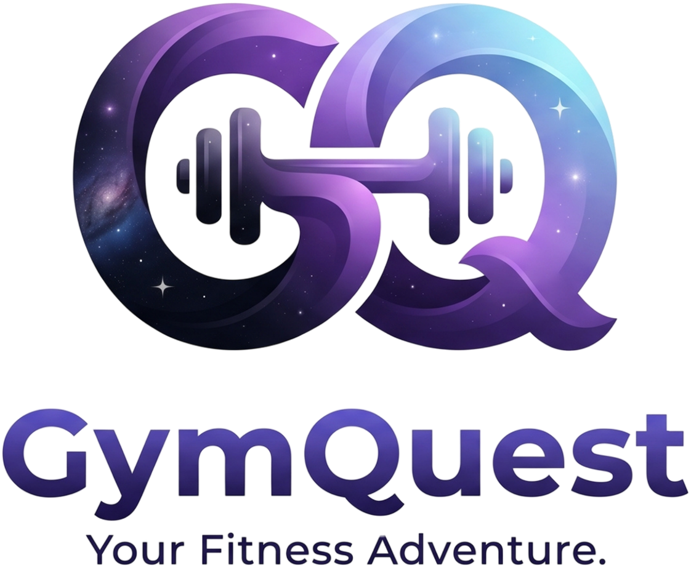

<p align="center">
  
</p>

<h1 align="center">🏋️ GymQuest — Real-Time Computer Vision Personal Trainer & 3D Gamified Fitness Platform</h1>

<p align="center">
  <strong>Sustainable, Free & Privacy-First Digital Fitness</strong><br>
  <em>Mengubah latihan fisik rumahan menjadi petualangan game interaktif (Arena Mode) dan program bimbingan terstruktur berbasis sains olahraga (Quest Mode) dengan Computer Vision real-time langsung di browser Anda.</em>
</p>

<p align="center">
  <a href="https://nextjs.org/"></a>
  <a href="https://react.dev/"></a>
  <a href="https://www.typescriptlang.org/"></a>
  <a href="https://supabase.com/"></a>
  <a href="https://vercel.com/"></a>
  <a href="https://developers.google.com/mediapipe"></a>
  <a href="https://threejs.org/"></a>
  <a href="https://sdgs.un.org/goals"></a>
  
  
</p>

---

## 👥 Profil Tim Pengembang

Karya orisinal dikembangkan untuk kompetisi **GAYATAMA 5 Web Technology Competition** oleh **Tim Semoga Kami Beruntung**:

1. **M. Faqih Ridho** — *Ketua Tim*
2. **Ananda Fitri Wibowo** — *Anggota*
3. **Muhammad Ardiansyah Tri Wibowo** — *Anggota*
4. **Muhammad Ziddan Habibi** — *Anggota*

---

## 📑 Daftar Isi

1. [🚀 Installation Guide (Panduan Instalasi & Menjalankan Proyek)](#-1-installation-guide-panduan-instalasi)
2. [💻 Technology Information (Informasi Teknologi & Tech Stack)](#-2-technology-information-informasi-teknologi)
3. [📖 Technical Documentation (Dokumentasi Teknis & Arsitektur Sistem)](#-3-technical-documentation-dokumentasi-teknis)
4. [🎯 Latar Belakang & Identifikasi Masalah](#-4-latar-belakang--identifikasi-masalah)
5. [🛡️ Prinsip Inti & Keunggulan](#-5-prinsip-inti--keunggulan)
6. [🎮 Fitur Utama Platform](#-6-fitur-utama-platform)
7. [🌍 Keselarasan Sustainable Development Goals (SDGs)](#-7-keselarasan-sustainable-development-goals-sdgs)
8. [📊 Status Pengembangan Proyek](#-8-status-pengembangan-proyek)
9. [📄 Lisensi & Hak Cipta](#-9-lisensi--hak-cipta)

---

## 🚀 1. Installation Guide (Panduan Instalasi)

Bagian ini memandu Anda mulai dari persiapan lingkungan (*prerequisites*), instalasi dependensi, konfigurasi basis data Supabase, hingga menjalankan GymQuest secara lokal maupun *production build*.

### A. Persyaratan Sistem (*Prerequisites*)

Pastikan perangkat Anda telah terpasang:
- **Node.js**: Versi `18.18.0` atau yang lebih baru (disarankan Node.js LTS v20.x atau v22.x).
- **Package Manager**: `npm` (bawaan Node.js), `pnpm`, atau `yarn`.
- **Peramban Web Modern**: Google Chrome, Microsoft Edge, Mozilla Firefox, atau Safari versi terbaru yang mendukung WebRTC, WebAssembly (WASM), dan WebGL.
- **Kamera Webcam**: Kamera internal laptop atau webcam USB eksternal yang berfungsi baik.

### B. Langkah Instalasi Langkah demi Langkah (*Step-by-Step*)

#### 1. Clone Repositori
Unduh kode sumber GymQuest dari GitHub ke komputer lokal Anda:

```bash
git clone https://github.com/MFaqihRidh0/Gym-Quest.git
cd Gym-Quest
```

#### 2. Konfigurasi Variabel Lingkungan (*Environment Variables*)
Salin berkas template lingkungan `.env.example` menjadi `.env.local`:

```bash
cp .env.example .env.local
```

Buka berkas `.env.local` dan lengkapi konfigurasi Supabase (opsional untuk sinkronisasi cloud, aplikasi tetap dapat berjalan 100% offline-first):

```env
# GymQuest Supabase Configuration
NEXT_PUBLIC_SUPABASE_URL=https://your-project-ref.supabase.co
NEXT_PUBLIC_SUPABASE_ANON_KEY=your-supabase-anon-key
NEXT_PUBLIC_SUPABASE_PUBLISHABLE_KEY=your-supabase-anon-key
```

#### 3. Pasang Dependensi Proyek
Jalankan instalasi pustaka dependensi via npm:

```bash
npm install
```

> 💡 **Unduhan Model AI Otomatis:**  
> Pada saat `npm install` dijalankan, skrip siklus hidup `postinstall` (`scripts/setup-mediapipe.mjs`) akan secara otomatis mengunduh biner model AI resmi Google MediaPipe (`pose_landmarker_lite.task`) dan pustaka WebAssembly ke dalam direktori `public/mediapipe/`. Anda tidak perlu mengunduh file model secara manual.

#### 4. Setup Basis Data Supabase (Opsional tapi Direkomendasikan)
Jika Anda ingin mengaktifkan sinkronisasi profil multi-perangkat dan papan peringkat cloud:
1. Buat proyek baru di [Supabase Dashboard](https://supabase.com/).
2. Buka menu **SQL Editor** pada dasbor Supabase Anda.
3. Buka berkas [`supabase_schema.sql`](./supabase_schema.sql) di repositori ini, salin seluruh isinya, tempelkan ke SQL Editor Supabase, lalu jalankan (**Run**).
4. Skrip ini akan membuat tabel `profiles`, `workout_logs`, `custom_programs`, mengaktifkan *Row Level Security* (RLS), dan membuat relasi trigger otomatis saat pengguna mendaftar.

#### 5. Menjalankan Server Pengembangan (*Development Mode*)
Nyalakan server lokal Next.js dengan compiler Turbopack:

```bash
npm run dev
```

Buka peramban Anda dan akses:
👉 **[http://localhost:3000](http://localhost:3000)**

*Izinkan akses kamera webcam saat peramban meminta izin (*browser camera permission prompt*) agar modul pendeteksi pose dapat bekerja.*

---

### C. Panduan Perintah CLI (*CLI Command Reference*)

| Perintah | Deskripsi & Kegunaan |
|---|---|
| `npm run dev` | Menjalankan server Next.js lokal pada port 3000 dengan Hot-Reloading cepat. |
| `npm run build` | Melakukan kompilasi produksi Next.js, pemeriksaan tipe TypeScript, dan verifikasi aset MediaPipe. |
| `npm run start` | Menjalankan server hasil kompilasi produksi (*production runtime*). |
| `npm run lint` | Menjalankan analisis statis kode menggunakan ESLint untuk menjaga kualitas kode. |
| `npm run format` | Memformat gaya penulisan kode sumber di seluruh proyek menggunakan Prettier. |
| `npm run setup:mediapipe` | Mengunduh ulang berkas model biner MediaPipe Pose ke folder `public/mediapipe/`. |

---

## 💻 2. Technology Information (Informasi Teknologi)

GymQuest dibangun dengan tumpukan teknologi modern berstandar industri yang mengutamakan performa *real-time*, keamanan data pengguna, dan portabilitas lintas platform.

```
+---------------------------------------------------------------------------------------+
|                                    GYMQUEST CLIENT                                    |
|  +---------------------+  +-------------------------+  +---------------------------+  |
|  |   Next.js 16 (App)  |  |    React 19 Frontend    |  |    Tailwind CSS v4 (UI)   |  |
|  +----------+----------+  +------------+------------+  +-------------+-------------+  |
|             |                          |                             |                |
|  +----------v--------------------------v-----------------------------v-------------+  |
|  |                           CLIENT-SIDE EXECUTION ENGINE                          |  |
|  |  +--------------------+  +----------------------+  +-------------------------+  |  |
|  |  |  MediaPipe (WASM)  |  | Three.js (3D Biomech)|  | Web Audio API (Synth)   |  |  |
|  |  |  33 Pose Landmarks |  | Muscle Highlight & 3D|  | 0 KB Audio Asset Engine|  |  |
|  |  +--------------------+  +----------------------+  +-------------------------+  |  |
|  |  +----------------------------------------------+  +-------------------------+  |  |
|  |  | WebRTC P2P Duel (Camera & Rep Stream)        |  | One Euro Jitter Filter  |  |  |
|  +--+----------------------------------------------+--+-------------------------+--+  |
+------------------------------------------+--------------------------------------------+
                                           |
                              HTTP / REST & WebSockets
                                           |
+------------------------------------------v--------------------------------------------+
|                              SUPABASE CLOUD INFRASTRUCTURE                            |
|  +---------------------+  +------------------------+  +----------------------------+  |
|  |  Supabase Auth      |  | PostgreSQL (JSONB Logs)|  | Realtime Presence/Broadcast|  |
|  |  Bcrypt Password RLS|  | Cloud Profile & History|  | Room Duel Signaling Hub    |  |
|  +---------------------+  +------------------------+  +----------------------------+  |
+---------------------------------------------------------------------------------------+
```

### Rincian Tumpukan Teknologi (*Tech Stack Matrix*)

| Domain | Teknologi Terpilih | Versi | Peran Utama & Alasan Pemilihan |
|---|---|---|---|
| **Core Framework** | [Next.js](https://nextjs.org/) (App Router) | `16.3.1` | Mendukung perenderan hibrida (SSR & CSR), routing modern, dan optimasi bundling aset klien. |
| **UI Library** | [React](https://react.dev/) | `19.2.0` | Menyediakan primitif reaktif dengan render performa tinggi tanpa lag visual. |
| **Language** | [TypeScript](https://www.typescriptlang.org/) | `5.9.3` | *Strict type-safety* untuk perhitungan vektor matematika, landmark 33 titik, dan status machine. |
| **Styling & Theme** | [Tailwind CSS](https://tailwindcss.com/) | `4.1.18` | Desain responsif berbasis utilitas dengan tema kustom *Cyberpunk Dark Navy & Neon Glow*. |
| **Computer Vision Engine** | [@mediapipe/tasks-vision](https://developers.google.com/mediapipe) | `0.10.22` | Inferensi deteksi 33 titik pose tubuh manusia berjalan **100% lokal** di browser via WebAssembly. |
| **3D Biomechanics** | [Three.js](https://threejs.org/) | `0.183.2` | Engine visualisasi manekin anatomi 3D interaktif 360° dengan pencahayaan otot agonis/sinergis. |
| **Database & Auth** | [Supabase](https://supabase.com/) | `2.100.1` | PostgreSQL database, otentikasi aman terenkripsi Bcrypt, serta Row Level Security (RLS). |
| **Multiplayer / Networking**| WebRTC & Supabase Realtime | Native API | Duel kamera P2P latensi rendah (*transceiver video*) dengan signaling broadcast terdistribusi. |
| **Procedural Audio** | Web Audio API | Native API | Sintesis suara interaktif (*countdown tick, level up, Kamehameha beam*) tanpa mengunduh file audio (0 KB). |
| **Internationalization** | Custom Context Engine | Native React | Mendukung dwibahasa penuh (**Bahasa Inggris default** & Bahasa Indonesia) yang dapat dialihkan instan. |
| **Deployment & Hosting** | [Vercel](https://vercel.com/) | Cloud CDN | Edge network deployment dengan aturan *cache-control* spesifik untuk file biner WASM (`vercel.json`). |

---

## 📖 3. Technical Documentation (Dokumentasi Teknis)

Bagian ini memaparkan arsitektur logika dan algoritma di balik modul-modul utama GymQuest.

### A. Dual-Pipeline Computer Vision Engine (`src/modules/cv-engine/`)

Pengolahan video kamera berkecepatan 60 frame per detik (FPS) di dalam aplikasi web memiliki tantangan konsumsi thread yang besar. GymQuest mengimplementasikan **Dual-Pipeline Architecture**:

```
                       [ Webcam Feed 60 FPS ]
                                 │
                     MediaPipe Pose Landmarker
                                 │
                   (33 Landmarks x, y, z, vis)
                                 │
                   One Euro Filter (Smoothing)
                                 │
       ┌─────────────────────────┴─────────────────────────┐
       ▼                                                   ▼
[ High-Frequency Pipeline ]                       [ Low-Frequency Pipeline ]
• Disimpan di liveLandmarksRef                    • Di-throttle ke 12 Hz (80ms)
• Animasi Kanvas Overlay 60 FPS                   • Sinkronisasi React State
• Validasi Sudut Sendi & Reps                     • Pembaruan Metrik UI & HUD
• Zero-Lag & Tanpa Re-render React                • Mencegah CPU Bottleneck
```

1. **Peredam Getaran Adaptif (One Euro Filter - `smoothing.ts`):**  
   Titik deteksi kamera rentan terhadap *jitter* akibat pencahayaan kamar. Algoritma One Euro Filter menggunakan frekuensi *cutoff* adaptif: saat tubuh diam, filter meningkatkan pemulusan (*heavy smoothing*); saat tubuh bergerak cepat, filter menurunkan jeda filter agar respons gerak seketika (<16ms).
2. **Koreksi Aspek Rasio Kanvas (`drawBioScan.ts`):**  
   Kamera laptop seringkali menghasilkan resolusi native 16:9 (misal 960×540 atau 1280×720), sementara antarmuka UI memotong kontainer video dengan properti CSS `object-cover`. GymQuest secara matematis menghitung faktor skala dan *offset horizontal/vertikal* sebelum menggambar garis neon skeleton di kanvas sehingga titik sendi tepat berada di atas tubuh pengguna.

---

### B. State Machine Penghitung Repetisi & Biomekanika (`src/modules/rep-counter/`)

Perhitungan repetisi latihan fisik tidak menggunakan timer perkiraan, melainkan analisis trigonometri sudut sendi:

1. **Perhitungan Sudut Sendi 2D (2D Vector Dot Product - `angles.ts`):**  
   Sudut sendi dihitung dari 3 titik landmark (contoh siku: Bahu $\vec{A}$, Siku $\vec{B}$, Pergelangan $\vec{C}$):
   $$\theta = \arccos\left(\frac{\vec{BA} \cdot \vec{BC}}{|\vec{BA}| \, |\vec{BC}|}\right) \times \frac{180}{\pi}$$
   Koordinat sumbu $Z$ MediaPipe sengaja diabaikan karena webcam monokular 2D standar memiliki tingkat derau kedalaman yang tinggi. Sisi kiri dan kanan dihitung proporsional terhadap nilai `visibility`.
2. **Finite State Machine (FSM) 3 Tahap (`repCounter.ts`):**  
   Untuk mencegah penghitungan ganda (*double-counting*), repetisi dikontrol oleh FSM:
   - **Tahap `up` (Posisi Awal):** Menunggu pengguna mulai menekuk sendi melintasi ambang batas turun.
   - **Tahap `down` (Posisi Puncak Kontraksi):** Sendi harus mencapai kedalaman valid (misal siku $\le 90^\circ$ pada push-up atau lutut $\le 100^\circ$ pada squat). Form posture diverifikasi.
   - **Tahap Ekstensi Kembali:** Ketika pengguna kembali mendorong tubuh ke atas hingga melintasi ambang batas atas ($\ge 160^\circ$), FSM menambah hitungan repetisi $+1$ dan membunyikan nada audio *ding*.

---

### C. Visualisasi 3D Biomekanika Anatomi (`src/components/ExerciseVisual3D.tsx`)

Bukan sekadar video tutorial rekaman pasif, GymQuest menyediakan manekin 3D prosedural Three.js interaktif:
- **Rotasi Penuh 360° & Orbit Controls:** Pengguna dapat memutar, memperbesar (*zoom*), dan mengganti sudut kamera pandang (*Front View*, *Side View*, *Isometric View*).
- **Pewarnaan Otot Agonis & Penstabil (*Muscular Highlighter*):**
  - Warna **Cyan Menyala**: Otot penggerak utama (*Agonist Muscle*, misal dada pada push-up atau paha pada squat).
  - Warna **Magenta Neon**: Otot sekunder penstabil (*Synergist/Stabilizer*, misal otot perut/core pada plank).
- **Panduan Sudut Ergonomis:** Dilengkapi kartu teks bimbingan posisi punggung, tumit, dan lutut untuk mencegah cedera sendi.

---

### D. Engine Duel Multiplayer WebRTC 1v1 P2P (`src/modules/multiplayer/`)

Mode pertarungan Player vs Player (PvP) berjalan secara peer-to-peer terdesentralisasi:
- **Upfront Video Transceiver:** Peer connection langsung mengonfigurasi `pc.addTransceiver('video', { direction: 'sendrecv' })` saat inisialisasi agar SDP selalu memiliki alokasi media video meskipun kamera lokal pengguna masih dalam proses memuat.
- **Dynamic Track Replacement (`RTCRtpSender.replaceTrack`):** Kapan pun kamera webcam siap atau diperbarui, track video langsung disuntikkan ke dalam koneksi WebRTC yang sedang berjalan tanpa perlu renegosiasi SDP yang rentan membeku (*stuck/freeze*).
- **Signaling Hub Terbuka:** Menggunakan Supabase Realtime Broadcast Channels untuk pertukaran sinyal ICE Candidate, Offer, dan Answer secara instan, dengan fallback otomatis ke *local browser BroadcastChannel* jika berjalan pada perangkat yang sama.

---

### E. Struktur Direktori Proyek

```
Gym-Quest/
├── public/
│   ├── mediapipe/               # Model AI biner WebAssembly lokal (offline-ready)
│   ├── logo-full.png            # Full lockup logo resmi GymQuest
│   ├── logo-emblem.png          # Emblem logo kosmik GymQuest Glow 3x
│   └── icon-192.png / 512.png   # Ikon PWA & launcher mobile
├── scripts/
│   └── setup-mediapipe.mjs      # Skrip pengunduh otomatis model MediaPipe
├── src/
│   ├── app/                     # Next.js 16 App Router Pages
│   │   ├── page.tsx             # Beranda utama cyberpunk & feature showcase
│   │   ├── auth/page.tsx        # Halaman autentikasi mandiri (Login & Register)
│   │   ├── programs/page.tsx    # Katalog program latihan sains & filter console
│   │   ├── programs/[id]/page.tsx# Detail program, kurikulum latihan, & panduan
│   │   ├── workout/page.tsx     # Cockpit latihan dual-mode (AI Camera / 3D Animation)
│   │   ├── arena/page.tsx       # Hub game kalistenik Arena Mode
│   │   ├── arena/battle/page.tsx# Dragon Ball Push-Up Battle 1v1 (Kamehameha vs Final Flash)
│   │   ├── leaderboard/page.tsx # Sistem 5 Kasta Liga Mingguan & bracket pemain nyata
│   │   ├── progress/page.tsx    # Dashboard metrik latihan, streak, & kalender riwayat
│   │   ├── layout.tsx           # Layout akar HTML (Default lang="en") & font styling
│   │   └── globals.css          # Desain sistem Tailwind CSS v4 & dark theme
│   ├── components/              # Komponen antarmuka modular
│   │   ├── AppNavbar.tsx        # Navbar adaptif desktop & drawer mobile Cyberpunk
│   │   ├── ExerciseVisual3D.tsx # Engine anatomi & biomekanika 3D interaktif (Three.js)
│   │   ├── CameraStage.tsx      # Komponen kanvas video kamera & overlay skeleton
│   │   ├── CustomWorkoutModal.tsx# Modal peracik menu latihan kustom
│   │   ├── OnboardingModal.tsx  # Modal assessment kebugaran awal (ACSM)
│   │   ├── LanguageSwitcher.tsx # Pengalih dwibahasa instan (EN / ID)
│   │   └── ui/CyberIcons.tsx    # Koleksi ikon SVG futuristik cyberpunk
│   ├── lib/
│   │   └── supabase/client.ts   # Klien koneksi Supabase & pencegah error offline
│   └── modules/
│       ├── cv-engine/           # MediaPipe pose landmarker, One Euro Filter, BioScan
│       ├── rep-counter/         # Perhitungan sudut sendi & finite state machine
│       ├── game-engine/         # Logika game push-up battle & Web Audio API prosedural
│       ├── program-engine/      # Data program latihan baku & penyimpanan riwayat
│       ├── gamification/        # Perhitungan EXP, 5 Kasta Liga, & filter pemain nyata
│       ├── i18n/                # Kamus terjemahan Bahasa Inggris & Bahasa Indonesia
│       └── auth/syncManager.ts  # Sinkronisasi cloud dua arah (Local <-> Supabase)
├── supabase_schema.sql          # Skrip skema database PostgreSQL, RLS policies, & triggers
├── vercel.json                  # Konfigurasi caching CDN edge untuk file biner WASM
└── package.json                 # Daftar dependensi & script runner proyek
```

---

## 🎯 4. Latar Belakang & Identifikasi Masalah

Kebugaran jasmani adalah hak universal. Namun, masyarakat modern menemui dua dinding penghalang utama:
1. **Ketimpangan Akses & Biaya (Financial Inequality):** Biaya menyewa Personal Trainer (PT) bersertifikat berkisar antara Rp 500.000 hingga Rp 2.500.000+ per bulan. Hal ini menjadikan bimbingan kebugaran yang benar sebagai privilese yang sulit dijangkau banyak kalangan.
2. **Tingginya Angka Cedera pada Olahraga Mandiri di Rumah:** Lebih dari **30–40% orang yang berolahraga di rumah mengalami cedera** (seperti lutut kolaps saat squat atau pinggang melengkung saat push-up) karena video tutorial YouTube bersifat satu arah tanpa ada yang mengoreksi postur gerak.
3. **Tingginya Angka Drop-Out:** Monotonnya repetisi gerakan membuat lebih dari **60% pemula berhenti berolahraga dalam 30 hari pertama**.

**GymQuest** menyelesaikan permasalahan tersebut dengan mendemokratisasi akses pelatihan kebugaran berkualitas tinggi: gratis, dapat diakses dari browser apa pun, menghitung dan memvalidasi gerakan via kamera secara aman (100% privasi terlindungi di perangkat pengguna), dan mengubah repetisi melelahkan menjadi pertarungan game yang seru.

---

## 🛡️ 5. Prinsip Inti & Keunggulan

- 🔒 **100% Privasi Terjamin (Client-Side WASM):** Pemrosesan citra kamera berjalan sepenuhnya di memori peramban pengguna menggunakan WebAssembly dan WebGL. **Video tidak pernah dikirim ke server mana pun.**
- ⚡ **Nol Latensi Jaringan (Instant Feedback):** Koreksi sudut postur dan validasi repetisi berlangsung dalam waktu <16 milidetik (60 FPS stabil).
- 💰 **Nol Biaya Komputasi Server GPU:** Menggunakan komputasi terdistribusi pada perangkat klien (*edge computing*), menjaga biaya operasional platform tetap gratis dan berkelanjutan.
- 🌐 **Dukungan Dwibahasa Internasional:** Mendukung Bahasa Inggris secara bawaan (*default*) dan Bahasa Indonesia dengan tombol pengalih instan di seluruh halaman.

---

## 🎮 6. Fitur Utama Platform

### 1. Quest Mode — Katalog Program & Cockpit Latihan (`/programs` & `/workout`)
- **Akses Langsung Tanpa Hambatan:** Pengguna dapat langsung menjelajah katalog program latihan tanpa dipaksa mengisi kuis penilaian di awal. Kuis kustom tersedia secara sukarela melalui tombol *"Fitness Quiz"*.
- **Filter 3 Dimensi Interaktif:** Pengguna dapat menyaring latihan berdasarkan *Tingkat Kemampuan* (Pemula, Menengah, Mahir), *Target Tubuh* (Bangun Otot, Bakar Lemak, Core, Mobilitas), dan *Durasi* (≤12 menit, 15 menit, ≥20 menit).
- **Dual Runner Mode:**
  - *AI Camera Mode:* Kamera memindai tubuh, menghitung repetisi otomatis, dan memberikan instruksi audio saat form salah.
  - *3D Animation Mode:* Panduan visual manekin 3D Three.js 360° yang memperagakan tempo gerakan dan menyorot kelompok otot aktif.

### 2. Arena Mode — Dragon Ball Push-Up Battle 1v1 (`/arena/battle`)
- **Deteksi Gerakan Fisik Murni:** Tombol serang manual dan shortcut keyboard telah ditiadakan. Serangan murni hanya dapat dilepaskan melalui repetisi push-up fisik nyata di depan kamera:
  - Posisi turun dada (< 40% sudut siku) otomatis mengisi energi **Ki Charge**.
  - Dorongan naik sempurna (> 68%) otomatis melepaskan tembakan jurus dahsyat **Kamehameha / Final Flash** untuk mengurangi HP lawan.
- **Dukungan Lawan:** Bermain melawan AI Bot adaptif (Novice, Knight, Master) atau melawan pemain lain secara daring (*Online 1v1 PvP* via WebRTC).

### 3. Papan Peringkat Bersih & Kompetisi 5 Kasta Liga (`/leaderboard`)
- **100% Pemain Nyata:** Seluruh akun bot fiktif telah dibersihkan. Klasemen hanya menampilkan pengguna nyata yang terdaftar di basis data Supabase berdasarkan akumulasi latihan sungguhan.
- **Sistem 5 Kasta Liga Mingguan:** Liga Iron ➔ Bronze ➔ Silver ➔ Gold ➔ Titan dengan promosi bagi 3 terbaik dan degradasi bagi posisi terbawah setiap 7 hari.

---

## 🌍 7. Keselarasan Sustainable Development Goals (SDGs)

| Logo | Target SDG PBB | Implementasi Nyata di GymQuest |
|---|---|---|
| 🟢 | **SDG 3: Good Health and Well-being** | Menurunkan angka gaya hidup sedenter dengan menghadirkan platform kebugaran mandiri yang terbukti menurunkan risiko cedera lewat koreksi form sendi real-time. |
| 🔵 | **SDG 10: Reduced Inequalities** | Menghapus kesenjangan finansial dan geografis terhadap akses pelatih kebugaran bersertifikat. Semua orang dengan kamera laptop/HP dapat menikmati bimbingan olahraga kelas dunia secara gratis. |

---

## 📊 8. Status Pengembangan Proyek

| Modul / Fitur | Spesifikasi Teknis | Status |
|---|---|---|
| **Fondasi & Framework** | Next.js 16 App Router, React 19, Tailwind CSS v4, TypeScript 5 | ✅ Selesai |
| **Computer Vision Engine** | MediaPipe Pose WASM lokal, One Euro Filter, BioScan HUD Canvas | ✅ Selesai |
| **Rep Counter & Form Check** | Perhitungan sudut sendi 2D dot product, 3-Phase FSM | ✅ Selesai |
| **3D Biomechanics Viewer** | Three.js WebGL manekin anatomi, agonis/sinergis muscle highlight | ✅ Selesai |
| **Arena 1v1 Push-Up Battle** | Gerakan push-up fisik murni, WebRTC P2P camera feed | ✅ Selesai |
| **Leaderboard Tanpa Bot** | Sinkronisasi Supabase `profiles` akun nyata, 5 Kasta Liga mingguan | ✅ Selesai |
| **Mobile Responsiveness** | Layout adaptif smartphone (360px-430px), Cyberpunk drawer navbar | ✅ Selesai |
| **Sistem Dwibahasa (i18n)** | Bahasa Inggris bawaan (*default*) & Bahasa Indonesia instan | ✅ Selesai |
| **Cloud Sync & Autentikasi** | Supabase Auth, PostgreSQL RLS, offline-first local fallback | ✅ Selesai |

---

## 📄 9. Lisensi & Hak Cipta

Dikembangkan dengan penuh dedikasi untuk kompetisi **GAYATAMA 5 Web Technology Competition** oleh **Tim Semoga Kami Beruntung**:
- **M. Faqih Ridho** (Ketua)
- **Ananda Fitri Wibowo**
- **Muhammad Ardiansyah Tri Wibowo**
- **Muhammad Ziddan Habibi**

Seluruh aset antarmuka, komponen kode, dan logika game dirancang secara orisinal. Pustaka pihak ketiga (Google MediaPipe, Three.js, Supabase, Next.js) tunduk pada lisensi open-source masing-masing (Apache-2.0 / MIT).
